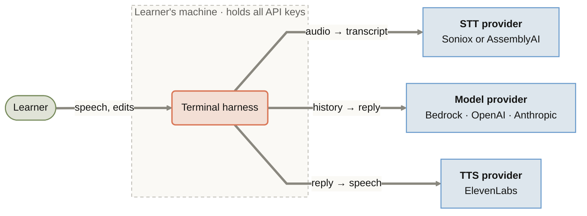
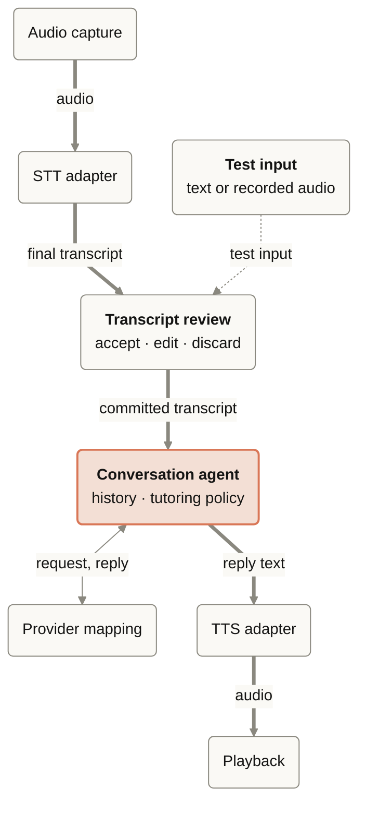
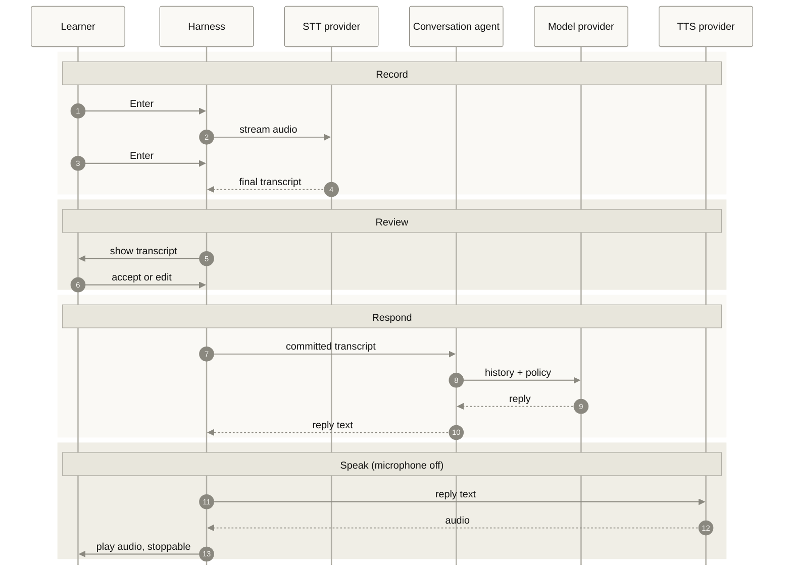
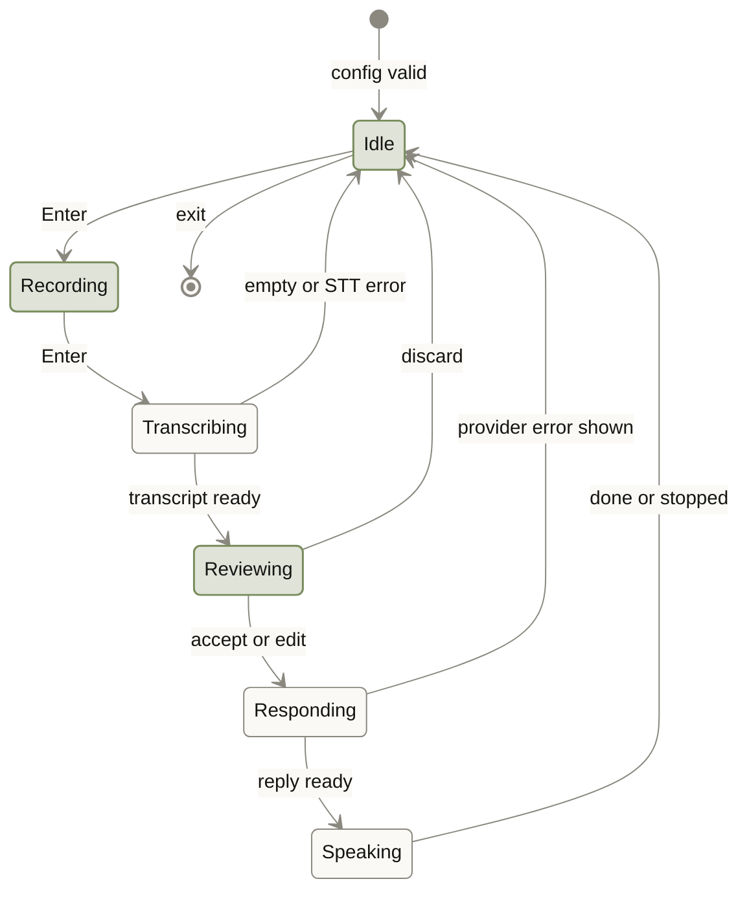

# Architecture

**Status: planned.** Nothing here is implemented yet. The diagrams describe the
[README](../README.md) design for the first version: a terminal push-to-talk
harness. Node names use the README's terms until code exists.

## How to read this doc

The four diagrams zoom in step by step. Each one answers a single question, and
names and colours stay the same across all four, so you can follow a box from
one diagram to the next.

1. [Context](#1-context): what does slang talk to?
2. [Components](#2-components): what are its parts, and what flows between them?
3. [One turn](#3-one-turn): what happens, in order, when the learner speaks?
4. [Turn states](#4-turn-states): what can the harness be doing at any moment?

Start with the legend. Every diagram uses only these shapes and lines.

```mermaid
---
config:
  theme: base
  fontFamily: "ui-sans-serif, -apple-system, 'Segoe UI', 'Helvetica Neue', Arial, 'Noto Sans', sans-serif"
  themeVariables:
    fontSize: 15px
    primaryColor: "#faf9f5"
    primaryTextColor: "#141413"
    primaryBorderColor: "#8a887f"
    lineColor: "#8a887f"
    edgeLabelBackground: "#faf9f5"
    clusterBkg: "#faf9f5"
    clusterBorder: "#b0aea5"
  flowchart:
    curve: linear
    nodeSpacing: 40
    rankSpacing: 56
    padding: 14
---
flowchart LR
    accTitle: Diagram legend
    accDescr: One example of each node kind, edge kind, and boundary used in this doc.

    person([Person])
    subgraph boundary [Trust boundary]
        core(<b>Core</b><br/>owns state or policy)
        module(<b>Module</b><br/>adapter or plumbing)
    end
    external[External service]

    person ==>|primary path| core
    core -->|data flow| module
    module -.->|optional or test-only| external

    classDef person fill:#e0e3d7,stroke:#788c5d,stroke-width:1.5px,color:#141413
    classDef core fill:#f3dfd5,stroke:#d97757,stroke-width:2px,color:#141413
    classDef module fill:#faf9f5,stroke:#8a887f,stroke-width:1px,color:#141413
    classDef external fill:#dde6ed,stroke:#6a9bcc,stroke-width:1.5px,color:#141413
    classDef boundary fill:#faf9f5,stroke:#b0aea5,stroke-dasharray:5 4,color:#5e5d59
    class person person
    class core core
    class module module
    class external external
    class boundary boundary
```

| Element | Looks like | In slang |
|---|---|---|
| Person | Green stadium | The learner. In the state diagram, a green state is waiting for the learner. |
| Core | Orange rounded box | Code that owns conversation state or tutoring policy. Start reading here. |
| Module | Plain rounded box | Code we own that moves data: audio, adapters, terminal input and output |
| External service | Blue square box | A paid provider API reached over the network |
| Trust boundary | Dashed region | The learner's machine, which holds every API key |
| Primary path | Thick arrow | The route a spoken turn takes; follow it first |
| Data flow | Arrow, labelled with what moves | Always a noun: `audio`, `reply text` |
| Optional or test-only | Dotted arrow | Test entry points and paths that aren't always taken |

## Glossary

| Term | Meaning |
|---|---|
| STT | Speech-to-text: turns recorded audio into a transcript. |
| TTS | Text-to-speech: turns the tutor's reply into audio. |
| Model provider | The LLM API that generates tutor replies: Bedrock, OpenAI, or Anthropic. Fixed for a session. |
| Turn | One learner utterance and the tutor's reply. The learner starts and ends it with Enter. |
| Partial transcript | STT output shown while the learner is still speaking. It never enters the conversation. |
| Committed transcript | The transcript the learner accepted or edited. Only this enters the conversation history. |
| Tutoring policy | The app-owned instructions: target language, learner level, and when to correct. |

## 1. Context

What does slang talk to, and what crosses the edge of the learner's machine?

Each arrow is one request and its response (`request → response`).
Audio and transcripts leave the machine only to the three providers chosen for
the session. If a provider fails, the error is shown; the harness never
silently switches to another one.

## 2. Components

What are the harness's parts, and what flows between them?

The conversation agent is the core. It owns the history and the tutoring policy,
and it imports no provider SDK. Everything else is an adapter around it, so a
provider can change without touching tutoring logic. Only committed transcripts
reach the agent.

## 3. One turn

What happens, in order, from the first Enter to the end of playback?

The Enter key, not silence detection, marks the end of the learner's turn.
The microphone is off during playback, so the tutor's voice is never transcribed.

## 4. Turn states

What can the harness be doing at any moment, and what moves it on?

Green states wait for the learner; plain states are the harness working.
Every failure returns to `Idle` with the error shown, so the learner can always
start another turn. The microphone is open only in `Recording`. Exit closes the
audio devices and provider connections.
