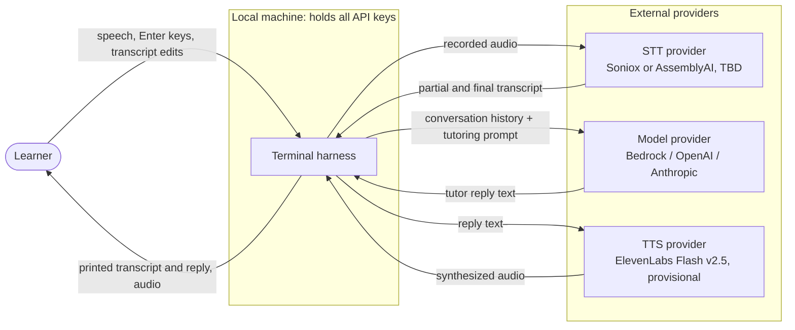
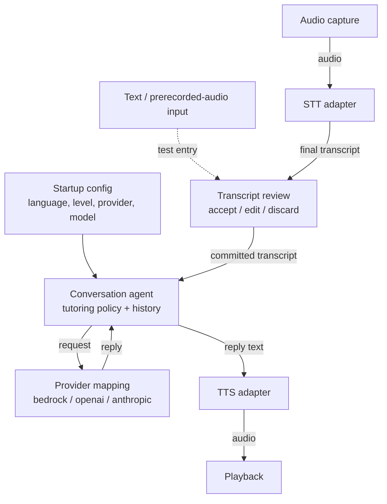
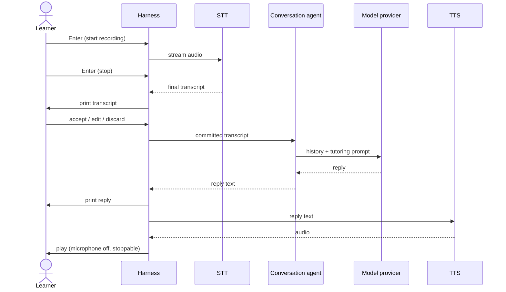
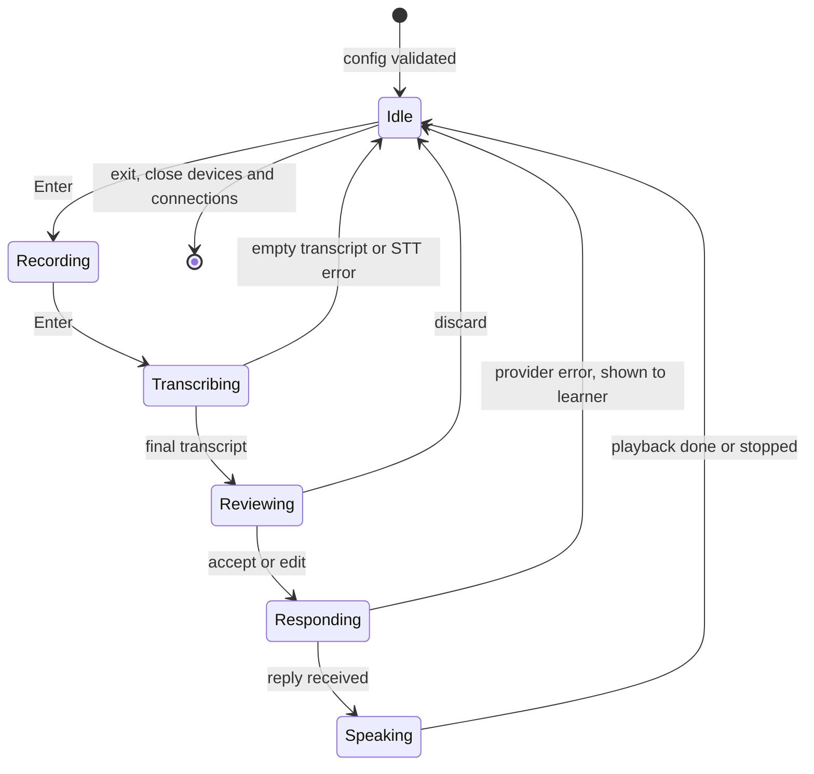

# Architecture

Status: planned. Nothing here is implemented yet; the diagrams describe the
design in the [README](../README.md) for the first version, a terminal
push-to-talk harness. Node names use the README's terms until code exists.

## Context

Audio and transcripts leave the machine only to the three providers selected
for the session; there is no automatic failover to another provider.

## Components

The conversation agent owns the history and tutoring policy and depends on no
provider SDK; provider mappings, STT, and TTS are adapters around it.
Only committed transcripts reach the agent.

## Main flow: one turn

The manual Enter press, not silence detection, defines the turn boundary.

## State: harness turn loop

The microphone is active only in `Recording`, which prevents playback
feedback. Provider and model are fixed for the session.
