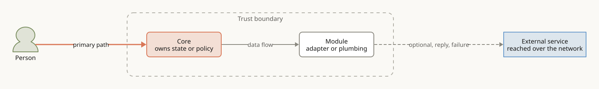
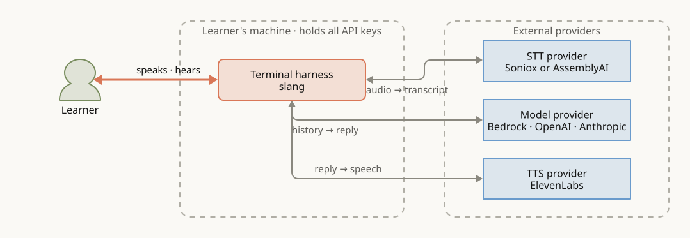
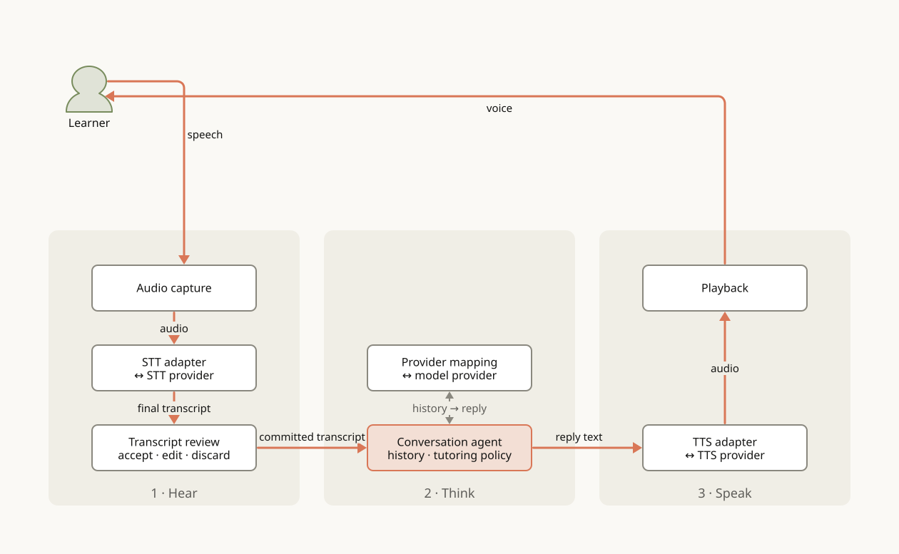
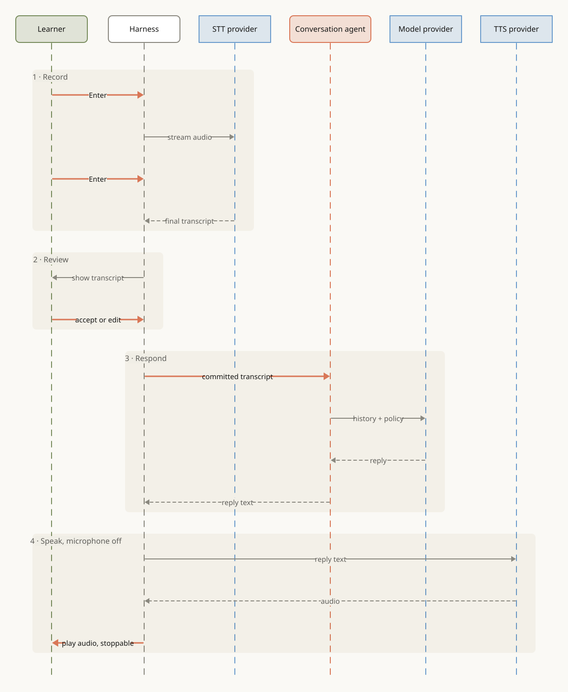
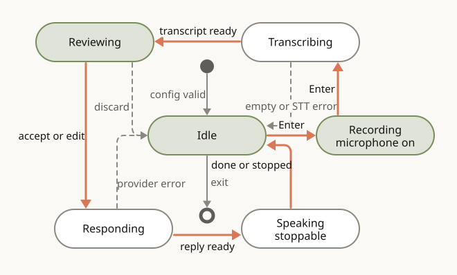

# Architecture

**Status: planned.** Nothing here is implemented yet. The diagrams describe the
README's design for the first version: a terminal push-to-talk
harness. Node names use the README's terms until code exists.

## How to read this doc

The four diagrams zoom in step by step. Each one answers a single question, and
names and colours stay the same across all four, so you can follow a box from
one diagram to the next.

1. [Context](#1-context): what does slang talk to?
2. [Data flow](#2-data-flow): what are its parts, and what moves between them?
3. [One turn](#3-one-turn): what happens, in order, when the learner speaks?
4. [Turn states](#4-turn-states): what can the harness be doing at any moment?

Diagram sources are D2 files in `docs/diagrams/`. Edit the `.d2` file,
then run `docs/diagrams/render.sh`, and commit the source and the SVG together.

## Legend

| Element | Looks like | In slang |
|---|---|---|
| Person | Green figure | The learner |
| Core | Orange box | Code that owns conversation state or tutoring policy. Start reading here. |
| Module | White box | Code we own that moves data: audio, adapters, terminal input and output |
| External service | Blue box | A paid provider API reached over the network |
| Stage | Oat panel, name at the bottom | A step of a turn: Hear, Think, Speak |
| Trust boundary | Dashed outline | The learner's machine, which holds every API key |
| Primary path | Thick orange arrow | The route a spoken turn takes; follow it first |
| Data flow | Grey arrow | Something moves; the label says what |
| Reply, failure, or optional | Dashed grey arrow | Responses, error returns, and paths not always taken |

In the turn states diagram, a green state is waiting for the learner and a white
one is the harness working. In the one-turn diagram, each lifeline takes the
colour of its participant's kind.

## Glossary

| Term | Meaning |
|---|---|
| STT | Speech-to-text: turns recorded audio into a transcript. |
| TTS | Text-to-speech: turns the tutor's reply into audio. |
| Model provider | The LLM API that generates tutor replies: Bedrock, OpenAI, or Anthropic. Fixed for a session. |
| Turn | One learner utterance and the tutor's reply. The learner starts and ends it with Enter. |
| Partial transcript | STT output shown while the learner is still speaking. It never enters the conversation. |
| Committed transcript | The transcript the learner accepted or edited. Only this enters the conversation history. |
| Tutoring policy | The app-owned instructions: target language, learner level, and when to correct. |

## 1. Context

What does slang talk to, and what crosses the edge of the learner's machine?

Each provider edge is one request and its response (`request → response`).
Audio and transcripts leave the machine only to the three providers chosen for
the session. If a provider fails, the error is shown; the harness never
silently switches to another one.

## 2. Data flow

What are the harness's parts, and what moves between them in one turn?

Read the orange path as a U: down through Hear, across Think, up through Speak.
The conversation agent is the core. It owns the history and the tutoring policy,
and it imports no provider SDK. Every `↔` box is an adapter for one external
provider, so a provider can change without touching tutoring logic. Only
committed transcripts reach the agent.

## 3. One turn

What happens, in order, from the first Enter to the end of playback?

The Enter key, not silence detection, marks the end of the learner's turn.
The microphone is off during playback, so the tutor's voice is never transcribed.

## 4. Turn states

What can the harness be doing at any moment, and what moves it on?

Follow the orange loop for a successful turn. Every dashed arrow returns to
`Idle` with the error shown, so the learner can always start another turn. The
microphone is open only in `Recording`. Exit closes the audio devices and
provider connections.
